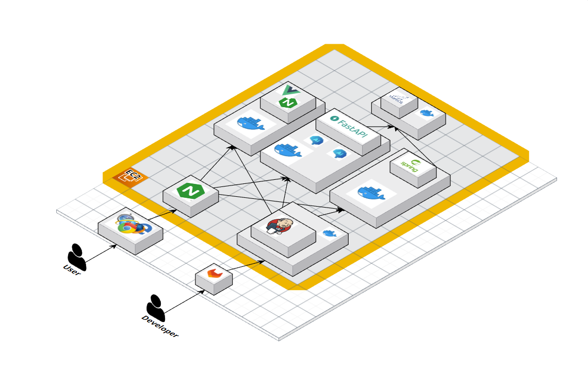
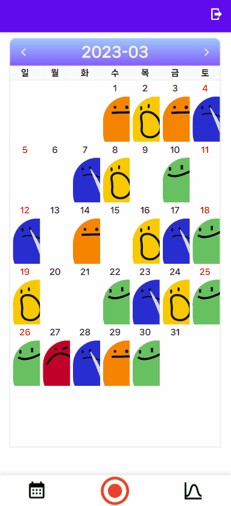
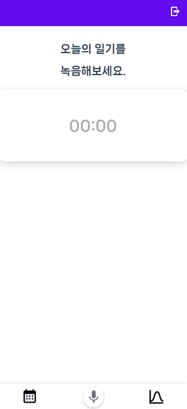
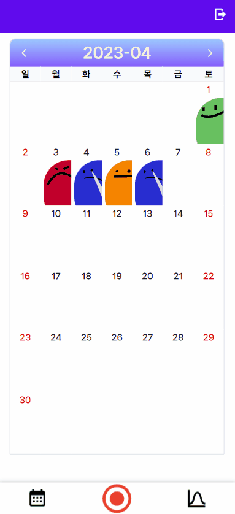
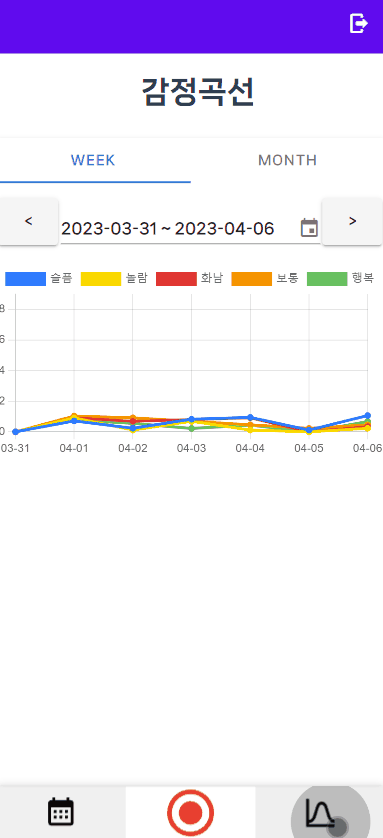

# 🎆 VODA - 음성 감정 일기


## 💜 프로젝트 진행 기간

2023.02.20(월) ~ 2023.04.07(금)

SSAFY 8기 2학기 공통프로젝트 - VODA (VoiceDiary)

<br>

## 🎵 VODA - 배경

여러분은 일기를 음성으로 기록한 경험이 있나요?? 만약 해보셨다면 자신의 음성 일기가 감정 분석을 해주는 서비스를 경험한 적이 있을까요??

VODA는 일기를 수기로 쓰는 불편함을 개선하고 그 날 하루의 스토리를 목소리로 담고 감정을 추출하여 기록해주는 서비스입니다.

<br>

## 💜 주요 기능

### 음성 감정 분석

- 자신의 목소리의 감정을 분석해요!!

### 텍스트 감정 분석

- 텍스트로 변환된 일기의 감정을 분석해요!!

### 감정 그래프

- 일기 감정을 기록한 데이터를 추출하여 주/월 단위로 감정 그래프를 보여줘요!!

### 유저 정보

- 특정 유저의 닉네임을 자유롭게 변경할 수 있어요!!

<br>

## ✔ 주요 기술

**Backend - Spring**

- JDK 11
- Springboot 2.7.9
- Gradle
- Spring Security
- Spring Data JPA
- Springfox Swagger UI: 2.9.2
- Lombok
- Logger
- Json Web Token
- AWS

**Backend - Python**

- Python 3.8.10
- Conda 23.10

**Frontend**

- Vue.js 2
- Vuetify 2
- Vuex 2.0
- Node LTS 18.14.2
- Npm lts

**개발환경**

- OS: window 10
- IDE
  - intelliJ
  - VScode
  - Figma
  - Colab
- Database
  - DBMS: Mariadb 10
- Server: AWS EC2
  - OS: Ubuntu 20.04 LTS (GNU/Linux 5.4.0-1018aws x86_64)
- CI/CD: Jenkins, Docker, Nginx
- Server
  - AWS EC2
  - Ubuntu 20.04 LTS
  - Docker
  - Jenkins
  - CertBot
- IDE
  - HeidiSQL
  - intelliJ IDEA
  - VSCode
  - VIM

<br>

## ✔ 시스템 아키텍처



<br>

## ✔ 프로젝트 파일 구조

```

    Java
    ├── gradle
    │   └── wrapper
    └── src
        └── main
            ├── java
            │   └── com
            │       └── project
            │           └── voda
            │               ├── config
            │               ├── controller
            │               ├── domain
            │               ├── dto
            │               ├── repository
            │               ├── service
            │               └── util
            └── resources
    Vue
    └── src
        ├── api
        ├── assets
        │   ├── KakaoLogin
        │   └── emotions
        ├── audio
        │   ├── components
        │   ├── library
        │   └── scss
        ├── components
        │   └── chart
        ├── plugins
        ├── router
        └── store
            └── modules
    Python
    ├── api
    │   ├── config
    │   ├── controller
    │   ├── model
    │   └── service
    ├── experiments
    │   └── emotion_text
    │       ├── KoBERT
    │       │   ├── imgs
    │       │   ├── kobert
    │       │   │   └── utils
    │       │   ├── kobert_hf
    │       │   │   └── kobert_tokenizer
    │       │   └── scripts
    │       │       └── NSMC
    │       └── loss
    ├── ser
    └── venv

```

<br>

## ✔ 협업 툴

- Git
- Notion
- JIRA
- MatterMost
- kakao Talk

<br>

## ✔ 협업 환경

- Gitlab
  - 코드의 버전을 관리
  - MR시, 팀원이 코드리뷰를 진행하고 피드백 게시
- JIRA
  - 매주 목표량을 설정하여 Sprint 진행
  - 업무의 할당량을 정하여 Story Point를 설정하고, In-Progress -> Done 순으로 작업
- Notion
  - 회의가 있을때마다 회의록을 기록하여 보관
  - 기술확보 시, 다른 팀원들도 추후 따라할 수 있도록 보기 쉽게 작업 순서대로 정리
  - 컨벤션 정리
  - 간트차트 활용하여 개발 계획 관리
  - 스토리보드, 스퀀스다이어그램, 기능명세서 등 모두가 공유해야 하는 문서 관리

<br>

## ✔ 팀원 역할

- 김재희 (BE & FE)

  - 팀장
  - 캘린더 & 감정 곡선 API 개발
  - 감정 곡선 & DataPicker UI 설계 및 API 통신

- 배정현 (Infra & BE)

  - CI/CD 구축 및 프로젝트 인프라 설계
  - JPA를 활용한 전체 도메인 설계
  - 감정 막대 그래프 UI 개발

- 안영훈 (BE & FE)

  - SpringSecurity + OAuth 2.0 로그인 및 유저 관리 API 개발
  - 로그인 & 음성 녹음 API 및 UI 레이아웃 개발
  - Jira 관리

- 유현준 (FE)

  - 프론트 총괄
  - 미디어 쿼리를 이용한 반응형 레이아웃 구현, 이모지 제작
  - 카카오 로그인, 회원가입, 달력, 다이어리, 하단 네비게이션 UI/UX design

- 조현동 (Infra & BE & AI)

  - AI : EDA, KoBERT Fintuning 및 음성 모델과 Ensemble
  - BE : FastAPI 설계 및 음성 일기 작성 API, SpringBoot 음성 일기 삭제, 읽기 API 구현
  - Infra : FastAPI 서버 CI/CD

- 박준하 (AI)

  - 음성 기반 감정 분류 딥 러닝 모델 개발 & 서버 이식
  - STT 라이브러리 인공지능 서버 이식

- 공통
  - 기능 & api 명세
  - DB 설계

---

## 💜 시연영상

#### 회원가입

  

#### 로그인

  

#### calendar



#### record

  

#### diary



#### chart



#### 로그아웃


